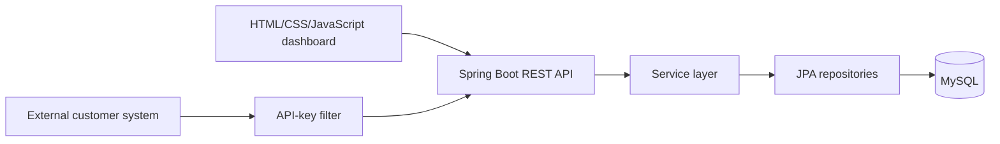
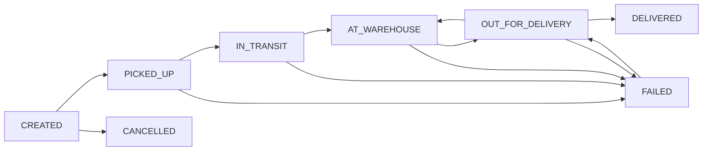

# Architecture

ShipHappens is a Spring Boot modular monolith. HTTP controllers receive validated DTOs, services enforce workflows and transactions, repositories contain database access, and Flyway owns schema evolution.

## Shipment lifecycle

