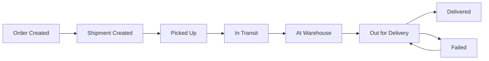

# Logistics Order & Delivery Management System
## Agent Build Specification

**Document version:** 1.0  
**Project type:** Portfolio-grade logistics SaaS backend + lightweight web frontend  
**Primary goal:** Build a realistic logistics management platform demonstrating Java/Spring Boot, REST APIs, SQL, Postman, data mapping, webhooks, troubleshooting, authentication concepts, workflow management, and operational reporting.

---

# 1. Project Objective

Build a logistics order and delivery management system that models the complete lifecycle of a shipment:

```text
Customer
   ↓
Order Creation
   ↓
Shipment Creation
   ↓
Warehouse Processing
   ↓
Driver / Vehicle Assignment
   ↓
Pickup
   ↓
In Transit
   ↓
Out for Delivery
   ↓
Delivered / Failed
```

The application must be designed as if it were a small SaaS logistics platform used by:

- Administrators
- Operations/Warehouse staff
- Customer Success/Support staff
- Drivers
- External customer systems

The project must emphasize **business workflow and integration reliability**, not merely CRUD functionality.

---

# 2. Target Stack

## Backend

- Java 17 or later LTS
- Spring Boot 3.x
- Spring Web
- Spring Data JPA
- Spring Validation
- Spring Security
- Maven
- Hibernate/JPA

## Database

- MySQL 8.x

## API / Integration

- REST APIs
- JSON
- Postman collection
- Webhook endpoints
- API-key authentication for external integration
- Basic OAuth/SSO concepts documented, but full OAuth implementation is optional

## Documentation

- OpenAPI / Swagger
- README.md
- Architecture documentation
- API documentation
- Integration documentation
- Troubleshooting guide

## Frontend

Use a lightweight frontend:

- HTML
- CSS
- JavaScript

Do not introduce React/Angular unless it provides a clear benefit. The backend and integration functionality are the priority.

## Development Tools

- Git
- GitHub-ready repository structure
- IntelliJ IDEA compatible
- Docker/Docker Compose optional but preferred for MySQL

---

# 3. Engineering Principles

The agent must follow these principles:

1. Use clean layered architecture.
2. Controllers must not contain business logic.
3. Business logic belongs in service classes.
4. Database access belongs in repository classes.
5. Use DTOs for API requests/responses instead of exposing entities directly.
6. Validate incoming requests.
7. Use meaningful HTTP status codes.
8. Implement centralized exception handling.
9. Use structured logging.
10. Never log passwords, API keys, tokens, or sensitive personal information.
11. Use transactions for multi-step database operations where appropriate.
12. Use enums for controlled status values.
13. Store timestamps consistently.
14. Use database constraints wherever practical.
15. Avoid duplicated business logic.
16. Write maintainable code that a junior engineer can understand.
17. Include comments only where they add useful context.
18. Do not hard-code secrets.
19. Use environment variables/configuration for database credentials and integration secrets.
20. The project must run from a clean checkout using documented commands.

---

# 4. Functional Roles

## 4.1 Admin

Can:

- View customers
- View orders
- View shipments
- Manage warehouses
- Manage drivers
- Manage vehicles
- Assign drivers
- Assign vehicles
- View tracking events
- View integration logs
- View operational dashboard

## 4.2 Operations User

Can:

- Create/update shipments
- Process warehouse operations
- Assign deliveries
- Update shipment status
- View operational information
- Record failed delivery attempts

## 4.3 Customer

Can:

- Create orders
- View own orders
- View shipment status
- View tracking history
- View estimated delivery information

## 4.4 Driver

Can:

- View assigned deliveries
- Update pickup status
- Update delivery status
- Record delivery failure reason
- Add proof-of-delivery metadata

## 4.5 External Integration

External systems can:

- Submit orders through an integration API
- Query shipment status
- Receive shipment status webhooks

---

# 5. Core Business Entities

The system should contain at least these entities:

```text
Customer
Address
Order
Package
Shipment
Warehouse
Driver
Vehicle
DeliveryAssignment
TrackingEvent
WebhookSubscription
IntegrationRequestLog
Notification
```

---

# 6. Order Workflow

An order should move through a controlled lifecycle.

Recommended order states:

```text
CREATED
CONFIRMED
CANCELLED
```

An order can contain one or more packages.

Example:

```text
Order ORD-10001
    ├── Package PKG-10001
    ├── Package PKG-10002
    └── Shipment SHP-10001
```

Business rules:

- Customer is required.
- Pickup address is required.
- Delivery address is required.
- At least one package is required.
- Weight must be greater than zero.
- Cancelled orders cannot be dispatched.
- An order cannot be cancelled after shipment delivery.
- Duplicate external order references must be rejected or handled idempotently.

---

# 7. Shipment Lifecycle

Shipment states:

```text
CREATED
PICKED_UP
IN_TRANSIT
AT_WAREHOUSE
OUT_FOR_DELIVERY
DELIVERED
FAILED
CANCELLED
```

Allowed transitions:

```text
CREATED → PICKED_UP
CREATED → CANCELLED

PICKED_UP → IN_TRANSIT
PICKED_UP → FAILED

IN_TRANSIT → AT_WAREHOUSE
IN_TRANSIT → FAILED

AT_WAREHOUSE → OUT_FOR_DELIVERY
AT_WAREHOUSE → FAILED

OUT_FOR_DELIVERY → DELIVERED
OUT_FOR_DELIVERY → FAILED
OUT_FOR_DELIVERY → AT_WAREHOUSE

FAILED → OUT_FOR_DELIVERY
```

Invalid transitions must return a clear business error.

Example:

```text
DELIVERED → IN_TRANSIT
```

must be rejected.

Every successful shipment status change must create a `TrackingEvent`.

---

# 8. Customer Requirements

Customer fields:

```text
id
customerCode
name
email
phone
status
createdAt
updatedAt
```

Customer status:

```text
ACTIVE
INACTIVE
```

Requirements:

- Customer code must be unique.
- Email should be validated.
- Phone should be validated.
- Inactive customers cannot create new orders.

---

# 9. Address Requirements

Address fields:

```text
id
customerId
addressLine1
addressLine2
city
state
postalCode
country
latitude
longitude
```

The system should support pickup and delivery addresses.

Latitude/longitude are optional but should be supported for future routing functionality.

---

# 10. Package Requirements

Package fields:

```text
id
packageCode
orderId
description
weightKg
lengthCm
widthCm
heightCm
declaredValue
```

Validation:

- weightKg > 0
- dimensions > 0 when provided
- declaredValue >= 0

---

# 11. Warehouse Requirements

Warehouse fields:

```text
id
warehouseCode
name
address
city
state
capacity
currentLoad
status
```

Warehouse status:

```text
ACTIVE
INACTIVE
```

Business rules:

- Inactive warehouses cannot receive shipments.
- currentLoad must not exceed capacity.
- Shipment entering a warehouse increases load.
- Shipment leaving a warehouse decreases load.

---

# 12. Driver Requirements

Driver fields:

```text
id
driverCode
name
phone
licenseNumber
status
```

Driver status:

```text
AVAILABLE
ASSIGNED
OFF_DUTY
INACTIVE
```

Business rules:

- Only AVAILABLE drivers can be assigned.
- Assigning a delivery changes driver status to ASSIGNED.
- Completing a delivery returns driver status to AVAILABLE.
- An inactive driver cannot be assigned.

---

# 13. Vehicle Requirements

Vehicle fields:

```text
id
vehicleNumber
vehicleType
capacityKg
status
```

Vehicle status:

```text
AVAILABLE
ASSIGNED
MAINTENANCE
INACTIVE
```

Business rules:

- Vehicle must have sufficient capacity for the shipment.
- Vehicle under maintenance cannot be assigned.
- Assigned vehicle cannot be simultaneously assigned to another active delivery.

---

# 14. Delivery Assignment

Fields:

```text
id
shipmentId
driverId
vehicleId
assignedAt
pickupAt
outForDeliveryAt
deliveredAt
status
```

Assignment status:

```text
ASSIGNED
PICKED_UP
OUT_FOR_DELIVERY
DELIVERED
FAILED
CANCELLED
```

Rules:

- One active delivery assignment per shipment.
- Driver must be available.
- Vehicle must be available.
- Vehicle capacity must be sufficient.
- Shipment must be in a valid state before assignment.

---

# 15. Tracking Events

Every important shipment event must be recorded.

Fields:

```text
id
shipmentId
eventType
status
description
location
createdAt
createdBy
```

Example events:

```text
SHIPMENT_CREATED
PICKED_UP
ARRIVED_WAREHOUSE
DEPARTED_WAREHOUSE
OUT_FOR_DELIVERY
DELIVERED
DELIVERY_FAILED
```

Tracking history must be ordered chronologically.

---

# 16. REST API Requirements

Base path:

```text
/api/v1
```

## Customer APIs

```http
POST   /customers
GET    /customers
GET    /customers/{id}
PUT    /customers/{id}
PATCH  /customers/{id}/status
```

## Order APIs

```http
POST   /orders
GET    /orders
GET    /orders/{id}
PUT    /orders/{id}
POST   /orders/{id}/cancel
```

## Package APIs

```http
POST   /orders/{orderId}/packages
GET    /orders/{orderId}/packages
```

## Shipment APIs

```http
POST   /shipments
GET    /shipments
GET    /shipments/{id}
PATCH  /shipments/{id}/status
GET    /shipments/{id}/tracking
```

## Warehouse APIs

```http
POST   /warehouses
GET    /warehouses
GET    /warehouses/{id}
PUT    /warehouses/{id}
```

## Driver APIs

```http
POST   /drivers
GET    /drivers
GET    /drivers/{id}
PUT    /drivers/{id}
```

## Vehicle APIs

```http
POST   /vehicles
GET    /vehicles
GET    /vehicles/{id}
PUT    /vehicles/{id}
```

## Delivery APIs

```http
POST   /deliveries/assign
GET    /deliveries
GET    /deliveries/{id}
PATCH  /deliveries/{id}/status
POST   /deliveries/{id}/fail
```

## Tracking

```http
GET /shipments/{shipmentId}/tracking
```

---

# 17. External Integration API

This is a major portfolio feature.

External customers must be able to submit orders through:

```http
POST /api/v1/integrations/orders
```

Authentication:

```text
X-API-KEY: <integration-api-key>
```

Example request:

```json
{
  "externalOrderId": "EXT-10045",
  "customerCode": "CUST-1001",
  "pickup": {
    "addressLine1": "Warehouse Road",
    "city": "Hyderabad",
    "state": "Telangana",
    "postalCode": "500001",
    "country": "India"
  },
  "delivery": {
    "addressLine1": "Electronic City",
    "city": "Bengaluru",
    "state": "Karnataka",
    "postalCode": "560100",
    "country": "India"
  },
  "packages": [
    {
      "description": "Electronic accessories",
      "weightKg": 5.5,
      "lengthCm": 30,
      "widthCm": 20,
      "heightCm": 15,
      "declaredValue": 12000
    }
  ]
}
```

The system must:

1. Authenticate the API key.
2. Validate the request.
3. Check externalOrderId for duplicates.
4. Map external data to internal entities.
5. Create customer/order/package/shipment records as required.
6. Record the integration request.
7. Return a clear response.
8. Generate a tracking event.
9. Return a correlation/request ID.

Example response:

```json
{
  "success": true,
  "requestId": "REQ-8a2c1",
  "externalOrderId": "EXT-10045",
  "orderId": "ORD-10045",
  "shipmentId": "SHP-10045",
  "status": "CREATED"
}
```

---

# 18. Data Mapping

Create a dedicated mapping layer/service.

Example:

```text
ExternalOrderRequest
        ↓
OrderMapper
        ↓
Customer
Order
Address
Package
Shipment
```

The mapping logic should not be embedded directly inside the controller.

Document:

- External field
- Internal field
- Data type
- Required/optional
- Transformation rule

Example:

| External Field | Internal Field | Transformation |
|---|---|---|
| externalOrderId | externalReference | Direct |
| pickup.city | pickupAddress.city | Direct |
| delivery.city | deliveryAddress.city | Direct |
| weightKg | package.weightKg | Direct |
| customerCode | customer.customerCode | Lookup |

---

# 19. Webhook Requirements

Implement outbound webhook support.

When important shipment events occur, the system should send a webhook to a subscribed external endpoint.

Webhook events:

```text
SHIPMENT_CREATED
SHIPMENT_PICKED_UP
SHIPMENT_IN_TRANSIT
SHIPMENT_AT_WAREHOUSE
SHIPMENT_OUT_FOR_DELIVERY
SHIPMENT_DELIVERED
SHIPMENT_FAILED
```

Example payload:

```json
{
  "eventId": "EVT-12345",
  "eventType": "SHIPMENT_DELIVERED",
  "occurredAt": "2026-09-22T10:30:00Z",
  "shipmentId": "SHP-10045",
  "orderId": "ORD-10045",
  "status": "DELIVERED"
}
```

Requirements:

- Store webhook subscription URL.
- Store secret/token securely.
- Generate unique event ID.
- Include event type.
- Include timestamp.
- Include shipment/order identifiers.
- Log delivery result.
- Handle non-2xx responses.
- Retry failed webhook delivery at least 3 times.
- Use increasing retry delays.
- Mark webhook delivery as FAILED after retry exhaustion.
- Do not expose secrets in logs.

For local development, create a mock webhook receiver endpoint.

---

# 20. Idempotency

Integration APIs must be idempotent.

For:

```http
POST /api/v1/integrations/orders
```

If the same:

```text
externalOrderId
```

is submitted twice, the system must not create duplicate orders.

Possible behavior:

- Return the existing order details.
- Clearly indicate that the request was already processed.

Create a unique database constraint for the external order reference where appropriate.

---

# 21. Integration Request Logging

Create an integration log.

Fields:

```text
id
requestId
integrationName
endpoint
httpMethod
externalReference
requestTimestamp
responseTimestamp
httpStatus
success
errorCode
errorMessage
```

Do not store secrets.

Optionally store sanitized request/response payloads.

---

# 22. Error Handling

Implement centralized error handling using:

```text
@RestControllerAdvice
```

Return consistent error responses.

Example:

```json
{
  "timestamp": "2026-09-22T10:30:00Z",
  "status": 400,
  "error": "VALIDATION_ERROR",
  "message": "weightKg must be greater than zero",
  "path": "/api/v1/orders",
  "requestId": "REQ-12345"
}
```

Handle at least:

```text
400 Bad Request
401 Unauthorized
403 Forbidden
404 Not Found
409 Conflict
422 Unprocessable Entity
500 Internal Server Error
```

---

# 23. Authentication and Authorization

Implement basic application authentication.

Roles:

```text
ADMIN
OPERATIONS
CUSTOMER
DRIVER
```

Use Spring Security.

Password requirements:

- Never store plaintext passwords.
- Use BCrypt or another secure password encoder.
- Do not expose passwords in API responses.

JWT authentication is preferred.

Authorization examples:

- ADMIN can manage everything.
- OPERATIONS can manage shipments/deliveries.
- CUSTOMER can only access their own orders.
- DRIVER can only access assigned deliveries.

External integration APIs should use API-key authentication.

---

# 24. SQL / Reporting Requirements

Implement useful reporting endpoints.

Examples:

```http
GET /api/v1/reports/shipments/status-summary
GET /api/v1/reports/deliveries/failure-summary
GET /api/v1/reports/warehouse/utilization
GET /api/v1/reports/delivery-performance
```

Examples of metrics:

- Total shipments
- Delivered shipments
- Failed shipments
- In-transit shipments
- Delivery success rate
- Warehouse utilization
- Average delivery duration
- Driver delivery count

Use SQL/JPA queries appropriately.

At least some reporting functionality should demonstrate real SQL aggregation.

---

# 25. Search and Filtering

Support filtering on shipments.

Example:

```http
GET /shipments?status=IN_TRANSIT
GET /shipments?customerId=10
GET /shipments?warehouseId=3
GET /shipments?fromDate=2026-09-01&toDate=2026-09-22
```

Support pagination:

```text
page
size
sort
```

Example:

```http
GET /shipments?page=0&size=20&sort=createdAt,desc
```

---

# 26. Dashboard

Create a simple dashboard.

Display:

```text
Total Orders
Active Shipments
In Transit
Out for Delivery
Delivered Today
Failed Deliveries
Available Drivers
Available Vehicles
Warehouse Utilization
```

Use simple HTML/CSS/JavaScript.

The dashboard should consume the REST APIs rather than directly accessing the database.

---

# 27. Browser Developer Tools Compatibility

The frontend should make debugging easy.

API failures should appear clearly in the browser network tab.

Frontend requirements:

- Show API response errors.
- Display HTTP status.
- Avoid swallowing errors silently.
- Use meaningful console messages during development.
- Do not log sensitive information.

---

# 28. Postman Collection

Create a Postman collection covering:

## Authentication

```text
Login
```

## Customers

```text
Create Customer
Get Customer
List Customers
```

## Orders

```text
Create Order
Get Order
Cancel Order
```

## Shipments

```text
Create Shipment
Update Shipment Status
Get Shipment
Get Tracking
```

## Drivers

```text
Create Driver
Assign Driver
```

## Vehicles

```text
Create Vehicle
```

## Integrations

```text
Submit External Order
Duplicate External Order
Invalid External Order
```

## Webhooks

```text
Create Subscription
Trigger Webhook
```

## Reports

```text
Shipment Status Summary
Delivery Performance
Warehouse Utilization
```

Include environment variables:

```text
baseUrl
jwtToken
apiKey
customerId
orderId
shipmentId
```

---

# 29. UAT Scenarios

Create a UAT document containing at least these scenarios.

### UAT-001: Create customer

Expected:

```text
HTTP 201
Customer created
Unique customer code
```

### UAT-002: Create order

Expected:

```text
HTTP 201
Order created
Shipment created
Tracking event generated
```

### UAT-003: Duplicate external order

Expected:

```text
No duplicate order
HTTP 409 or idempotent success response
```

### UAT-004: Assign unavailable driver

Expected:

```text
Request rejected
Clear error message
```

### UAT-005: Assign oversized shipment to vehicle

Expected:

```text
Request rejected
Vehicle capacity error
```

### UAT-006: Invalid shipment transition

Example:

```text
DELIVERED → IN_TRANSIT
```

Expected:

```text
HTTP 409/422
Transition rejected
```

### UAT-007: Successful delivery

Expected:

```text
Shipment = DELIVERED
Delivery = DELIVERED
Driver = AVAILABLE
Vehicle = AVAILABLE
Tracking event created
Webhook generated
```

### UAT-008: Failed delivery

Expected:

```text
Shipment = FAILED
Failure reason recorded
Tracking event created
Webhook generated
```

---

# 30. Testing Requirements

Use:

- JUnit 5
- Mockito
- Spring Boot Test
- MockMvc

Minimum tests:

### Unit tests

- OrderService
- ShipmentService
- DeliveryAssignmentService
- IntegrationService
- WebhookService
- MappingService

### Controller tests

Test:

- valid request
- invalid request
- unauthorized request
- not found
- conflict

### Integration tests

At least test:

```text
Create Order → Create Shipment → Assign Driver → Update Status → Deliver
```

### Integration API tests

Test:

```text
Valid external order
Duplicate external order
Invalid API key
Invalid payload
```

---

# 31. Database Design

Recommended relationships:

```text
Customer 1 ──── * Order

Order 1 ──── * Package

Order 1 ──── 1 Shipment

Shipment 1 ──── * TrackingEvent

Shipment 1 ──── * DeliveryAssignment

Driver 1 ──── * DeliveryAssignment

Vehicle 1 ──── * DeliveryAssignment

Warehouse 1 ──── * Shipment
```

The exact schema can be refined by the agent while maintaining these business relationships.

Add:

- Primary keys
- Foreign keys
- Unique constraints
- Indexes for commonly searched fields
- Created/updated timestamps

Important indexes:

```text
customer.customerCode
order.externalReference
order.createdAt
shipment.status
shipment.trackingNumber
tracking_event.shipmentId
delivery_assignment.driverId
delivery_assignment.vehicleId
```

---

# 32. Project Structure

Preferred structure:

```text
src/
 ├── main/
 │   ├── java/
 │   │   └── com.example.logistics/
 │   │       ├── config/
 │   │       ├── controller/
 │   │       ├── dto/
 │   │       ├── entity/
 │   │       ├── exception/
 │   │       ├── mapper/
 │   │       ├── repository/
 │   │       ├── security/
 │   │       ├── service/
 │   │       ├── integration/
 │   │       └── LogisticsApplication.java
 │   │
 │   └── resources/
 │       ├── application.yml
 │       ├── db/
 │       ├── static/
 │       └── templates/
 │
 └── test/
     └── java/
```

Package naming should be changed from `com.example` to a sensible project package.

---

# 33. Configuration

Use environment variables.

Example:

```text
DB_URL
DB_USERNAME
DB_PASSWORD
JWT_SECRET
EXTERNAL_API_KEY
WEBHOOK_SECRET
```

Provide:

```text
.env.example
```

Never commit real secrets.

---

# 34. Database Migration

Prefer Flyway.

Create versioned migrations:

```text
V1__create_customers.sql
V2__create_addresses.sql
V3__create_orders.sql
V4__create_packages.sql
V5__create_warehouses.sql
V6__create_drivers.sql
V7__create_vehicles.sql
V8__create_shipments.sql
V9__create_tracking_events.sql
V10__create_delivery_assignments.sql
V11__create_integrations.sql
```

The exact migration sequence can be adjusted based on foreign-key dependencies.

---

# 35. Seed Data

Provide development seed data.

At minimum:

```text
3 customers
2 warehouses
5 drivers
3 vehicles
5 orders
5 shipments
tracking events
one webhook subscription
one admin user
one operations user
one customer user
one driver user
```

Seed data must be safe and non-sensitive.

---

# 36. Logging

Use SLF4J/Logback.

Important events to log:

```text
Order created
Shipment status changed
Driver assigned
Vehicle assigned
External integration received
Webhook sent
Webhook failed
Validation/business errors
Unexpected exceptions
```

Example:

```text
INFO requestId=REQ-123 shipmentId=SHP-1001 statusChanged=IN_TRANSIT
```

Do not log:

```text
password
JWT
API key
webhook secret
```

---

# 37. Correlation / Request ID

Every request should have a request/correlation ID.

If the client sends:

```text
X-Request-ID
```

use it.

Otherwise generate one.

Return it in:

```text
X-Request-ID
```

and include it in logs.

This is important for troubleshooting integration issues.

---

# 38. Observability-Friendly Error Flow

The implementation should make this troubleshooting workflow possible:

```text
Customer reports problem
        ↓
Find request ID
        ↓
Check API request
        ↓
Check HTTP response
        ↓
Check application logs
        ↓
Check integration logs
        ↓
Check data mapping
        ↓
Check database
        ↓
Identify root cause
        ↓
Fix or escalate
```

Document this workflow in the troubleshooting guide.

---

# 39. API Documentation

Swagger/OpenAPI must document:

- Endpoint
- HTTP method
- Request parameters
- Request body
- Response
- Error responses
- Authentication
- Example payloads

Swagger should be accessible from a documented local URL.

---

# 40. README Requirements

README.md must contain:

1. Project overview
2. Business problem
3. Features
4. Architecture
5. Tech stack
6. Prerequisites
7. Setup instructions
8. Environment variables
9. Database setup
10. Running the backend
11. Running the frontend
12. Swagger URL
13. Postman setup
14. Sample credentials
15. API examples
16. Integration flow
17. Webhook flow
18. Testing commands
19. Troubleshooting
20. Future improvements

---

# 41. Architecture Documentation

Create:

```text
docs/architecture.md
```

Include:

```text
Client
  ↓
Frontend
  ↓
REST API
  ↓
Controller
  ↓
Service
  ↓
Repository
  ↓
MySQL
```

And integration flow:

```text
External Customer
       ↓
Integration API
       ↓
Authentication
       ↓
Validation
       ↓
Data Mapping
       ↓
Business Service
       ↓
Database
       ↓
Webhook Event
       ↓
External Customer
```

---

# 42. Workflow Diagram

Create documentation containing a shipment lifecycle diagram.

Preferred Mermaid:



---

# 43. Integration Failure Scenarios

The application must demonstrate handling of:

### Invalid API key

```text
401 Unauthorized
```

### Invalid payload

```text
400 Bad Request
```

### Duplicate external order

```text
409 Conflict or idempotent response
```

### Database failure

```text
500 Internal Server Error
```

### Webhook endpoint unavailable

```text
Retry
Retry
Retry
Mark FAILED
```

### Invalid shipment transition

```text
409/422
```

---

# 44. Performance Expectations

This is a portfolio application, not a production-scale platform.

Nevertheless:

- Use pagination.
- Avoid obvious N+1 queries.
- Add indexes.
- Avoid loading huge datasets unnecessarily.
- Use asynchronous processing for webhook delivery if practical.
- Do not introduce unnecessary microservices.

The initial implementation should be a **modular monolith**.

---

# 45. Security Requirements

At minimum:

- BCrypt passwords
- JWT authentication
- Role-based authorization
- API-key authentication for external integrations
- Input validation
- SQL injection protection through JPA/parameterized queries
- No secrets in source control
- No sensitive values in logs
- CORS configuration appropriate for local frontend
- Basic rate-limiting consideration documented, even if not implemented

---

# 46. Non-Functional Requirements

The system should be:

### Maintainable

Clear naming and separation of concerns.

### Testable

Business logic should be unit-testable.

### Observable

Logs and request IDs should make troubleshooting possible.

### Documented

A new developer should be able to run the project using README instructions.

### Extensible

Future features should be possible without rewriting the architecture.

---

# 47. Future Features

Do not implement these unless time permits, but document them:

```text
Real-time GPS tracking
Route optimization
Google Maps integration
ETA prediction
Driver mobile application
SMS/email notifications
Advanced analytics
Power BI integration
OAuth/SSO
Kafka/RabbitMQ event processing
Microservice decomposition
Cloud deployment
CI/CD
```

---

# 48. Optional Logistics Intelligence

If implementation time permits, add a simple delivery estimate.

Example:

```text
Estimated Delivery Date =
pickup date + estimated transit days
```

Do not use machine learning for the first version.

The project should prioritize reliable business workflows over unnecessary AI features.

---

# 49. Deliverables

The completed repository must contain:

```text
/backend
/frontend
/docs
/postman
/database
README.md
.env.example
docker-compose.yml
```

Recommended:

```text
docs/
 ├── architecture.md
 ├── api.md
 ├── integration-guide.md
 ├── troubleshooting.md
 ├── uat.md
 └── data-mapping.md

postman/
 └── Logistics-API.postman_collection.json
```

---

# 50. Definition of Done

The project is complete only when all of the following are true:

- [ ] Application starts successfully.
- [ ] MySQL database can be initialized from a clean environment.
- [ ] Database migrations execute successfully.
- [ ] Seed data can be loaded.
- [ ] Authentication works.
- [ ] Role-based authorization works.
- [ ] Customers can be created.
- [ ] Orders can be created.
- [ ] Packages can be created.
- [ ] Shipments can be created.
- [ ] Shipment lifecycle is enforced.
- [ ] Warehouses work.
- [ ] Drivers work.
- [ ] Vehicles work.
- [ ] Delivery assignments work.
- [ ] Tracking events are generated.
- [ ] External integration API works.
- [ ] API-key authentication works.
- [ ] Data mapping is implemented as a separate layer.
- [ ] Duplicate external orders are handled.
- [ ] Webhooks work.
- [ ] Webhook retries work.
- [ ] Integration requests are logged.
- [ ] Request/correlation IDs work.
- [ ] Centralized exception handling works.
- [ ] Swagger documentation works.
- [ ] Postman collection is included.
- [ ] UAT scenarios are documented.
- [ ] Unit tests exist.
- [ ] Integration tests exist.
- [ ] Dashboard works.
- [ ] README allows a new developer to run the application.
- [ ] No secrets are committed.
- [ ] No compilation errors.
- [ ] No failing automated tests.

---

# 51. Agent Execution Instructions

The coding agent should implement this project incrementally.

## Phase 1 — Foundation

1. Initialize Maven Spring Boot project.
2. Configure Java.
3. Configure MySQL.
4. Configure Flyway.
5. Create base package structure.
6. Configure global exception handling.
7. Configure logging.
8. Add request ID handling.

## Phase 2 — Database & Core Domain

Implement:

```text
Customer
Address
Order
Package
Shipment
TrackingEvent
Warehouse
Driver
Vehicle
DeliveryAssignment
```

Create migrations and repositories.

## Phase 3 — Core APIs

Implement:

```text
Customer APIs
Order APIs
Package APIs
Shipment APIs
Warehouse APIs
Driver APIs
Vehicle APIs
Delivery APIs
Tracking APIs
```

## Phase 4 — Business Rules

Implement:

- Status transitions
- Driver availability
- Vehicle capacity
- Warehouse capacity
- Duplicate prevention
- Validation
- Cancellation rules

## Phase 5 — Security

Implement:

- Login
- JWT
- Roles
- Authorization
- API-key integration authentication

## Phase 6 — External Integration

Implement:

- External order API
- Data mapping
- Idempotency
- Integration logging
- Request IDs

## Phase 7 — Webhooks

Implement:

- Subscriptions
- Event generation
- Delivery
- Retry
- Failure tracking
- Mock receiver

## Phase 8 — Dashboard & Reports

Implement:

- Dashboard
- Search/filtering
- Pagination
- Operational reports

## Phase 9 — Testing

Implement:

- Unit tests
- Controller tests
- Integration tests
- Integration API tests
- Webhook tests

## Phase 10 — Documentation

Create:

```text
README.md
architecture.md
api.md
integration-guide.md
data-mapping.md
troubleshooting.md
uat.md
Postman collection
```

---

# 52. Agent Quality Gate

Before declaring completion, the agent must:

1. Compile the entire project.
2. Run all automated tests.
3. Fix compilation/test failures.
4. Start the application.
5. Verify database connectivity.
6. Verify authentication.
7. Execute a complete shipment workflow.
8. Execute an external integration workflow.
9. Test duplicate integration request.
10. Trigger a webhook.
11. Test webhook failure/retry.
12. Verify Swagger.
13. Verify Postman collection.
14. Verify frontend dashboard.
15. Review logs for accidental secrets.
16. Verify `.gitignore`.
17. Confirm README setup instructions work from a clean environment.

Do not claim the project is complete if any required quality gate fails.

---

# 53. Complete Demonstration Scenario

The final application must support this demonstration:

```text
1. Create customer
        ↓
2. Create order
        ↓
3. Add package
        ↓
4. Create shipment
        ↓
5. Assign warehouse
        ↓
6. Assign available driver
        ↓
7. Assign available vehicle
        ↓
8. Mark PICKED_UP
        ↓
9. Mark IN_TRANSIT
        ↓
10. Mark AT_WAREHOUSE
        ↓
11. Mark OUT_FOR_DELIVERY
        ↓
12. Mark DELIVERED
        ↓
13. Create tracking events
        ↓
14. Send SHIPMENT_DELIVERED webhook
        ↓
15. Driver becomes AVAILABLE
        ↓
16. Vehicle becomes AVAILABLE
```

The external integration demonstration must support:

```text
External System
      ↓
POST /integrations/orders
      ↓
API-key validation
      ↓
Request validation
      ↓
Idempotency check
      ↓
Data mapping
      ↓
Create order/shipment
      ↓
Integration log
      ↓
Response with request ID
      ↓
Later shipment status change
      ↓
Webhook to external system
```

---

# 54. Portfolio Positioning

The completed project should demonstrate these resume/interview skills:

```text
Java
Spring Boot
REST APIs
MySQL
SQL
JPA/Hibernate
Postman
API Integration
Webhooks
Data Mapping
Authentication
JWT
API Keys
Logging
Debugging
Browser Developer Tools
UAT
Exception Handling
Testing
Business Workflow Design
Documentation
Git
```

The project should look like a realistic **logistics SaaS implementation platform**, not a generic student CRUD application.

---


---

# 56. Project Identity

**Product name:** ShipHappens

**Official project title:**

> **ShipHappens — Logistics Order & Integration Management Platform**

The name is intentionally informal/fun, but the application itself must be implemented as a professional logistics SaaS platform.

Repository name recommendation:

```text
shiphappens-logistics-platform
```

Suggested package name:

```text
com.shiphappens.logistics
```

Suggested API title:

```text
ShipHappens Logistics API
```

---

# 57. Deployment Objective

The project must be designed so it can be deployed as a publicly accessible portfolio application.

The final deployment should provide:

```text
Public Frontend URL
        ↓
Public Spring Boot API
        ↓
Managed MySQL Database
        ↓
Webhook / Integration Endpoints
```

The deployed system must not require the interviewer to install Java, Maven, or MySQL locally just to see the application.

A local development setup must still be supported.

---

# 58. Recommended Production Architecture

Use a simple modular-monolith architecture.

```text
                         ┌─────────────────────┐
                         │   ShipHappens UI    │
                         │ HTML/CSS/JavaScript │
                         └──────────┬──────────┘
                                    │ HTTPS
                                    ↓
                         ┌─────────────────────┐
                         │   Spring Boot API   │
                         │     REST + Auth     │
                         └──────┬────────┬─────┘
                                │        │
                         ┌──────┘        └──────────┐
                         ↓                           ↓
                ┌─────────────────┐       ┌──────────────────┐
                │ Managed MySQL   │       │ External Systems │
                │    Database     │       │ / Webhooks      │
                └─────────────────┘       └──────────────────┘
```

Do not split the application into microservices for the first version.

---

# 59. Production Deployment Stack

The exact cloud provider may be selected by the coding agent based on current compatibility, free/low-cost availability, and ease of deployment.

Preferred architecture:

### Frontend

Use a static hosting platform such as:

- Vercel
- Netlify
- Cloudflare Pages
- GitHub Pages where compatible

### Backend

Use a managed application platform such as:

- Render
- Railway
- Fly.io
- AWS
- Azure
- Google Cloud

The implementation must not hard-code provider-specific functionality unless necessary.

### Database

Use managed MySQL where possible.

Local development may use:

```text
Docker MySQL
```

Production must use a managed database or persistent database service.

---

# 60. Docker Requirements

Create a Dockerfile for the Spring Boot backend.

Requirements:

- Multi-stage build preferred.
- Use a Java runtime image appropriate for the selected Java version.
- Do not include source code unnecessarily in the runtime image.
- Do not include secrets in the Dockerfile.
- Application must read configuration from environment variables.

Example conceptual flow:

```text
Maven Build
    ↓
JAR
    ↓
Runtime Docker Image
    ↓
Spring Boot
```

Also create:

```text
docker-compose.yml
```

for local development.

Recommended local services:

```text
backend
mysql
```

Frontend may either run independently or be served as static files.

---

# 61. Docker Compose Requirements

A developer should be able to start the local infrastructure using:

```bash
docker compose up -d
```

The setup should provide:

```text
MySQL
Spring Boot backend
```

where practical.

Database credentials must come from environment variables or a local `.env` file.

Provide:

```text
.env.example
```

Do not commit:

```text
.env
```

---

# 62. Environment Configuration

Separate configuration into environments:

```text
local
test
production
```

Recommended environment variables:

```text
SPRING_PROFILES_ACTIVE
DB_URL
DB_USERNAME
DB_PASSWORD
JWT_SECRET
EXTERNAL_API_KEY
WEBHOOK_SECRET
CORS_ALLOWED_ORIGINS
```

Optional:

```text
WEBHOOK_TIMEOUT_MS
WEBHOOK_MAX_RETRIES
LOG_LEVEL
```

Never commit production secrets.

---

# 63. Production Database Requirements

Production database configuration must:

- Use SSL/TLS where supported.
- Use strong credentials.
- Use a non-root database user.
- Run Flyway migrations automatically or through a documented deployment step.
- Have appropriate connection pool settings.
- Never use development seed passwords in production.
- Never expose the database publicly unless required by the selected provider.
- Never expose MySQL port 3306 to the public internet unnecessarily.

---

# 64. Database Migration Strategy

Flyway remains the database migration tool.

Production deployment must execute migrations in a controlled manner.

Rules:

1. Never manually modify the production schema without a migration.
2. Every schema change must have a new migration.
3. Do not modify an already-applied migration.
4. Migration filenames must be versioned.
5. Test migrations against a clean database before deployment.

---

# 65. Health Check Endpoints

Implement:

```http
GET /actuator/health
```

Use Spring Boot Actuator.

The health endpoint should allow the hosting platform to determine whether the application is alive.

Prefer separate health/readiness information where supported.

Do not expose sensitive environment/configuration information through Actuator.

Do not expose:

```text
JWT secret
database password
API keys
environment secrets
```

---

# 66. Production Logging

Production logs must be suitable for troubleshooting.

Include:

```text
timestamp
level
requestId
HTTP method
path
status
duration
user/integration context where safe
```

Example:

```text
INFO requestId=REQ-8392 method=POST path=/api/v1/integrations/orders status=201 durationMs=182
```

Never log:

```text
password
JWT
API key
webhook secret
authorization header
full sensitive payloads
```

If request/response payload logging is implemented for debugging, sanitize sensitive fields.

---

# 67. CORS

Configure CORS through environment configuration.

Development:

```text
http://localhost:3000
```

or the actual frontend development origin.

Production:

```text
https://<deployed-frontend-domain>
```

Do not use unrestricted:

```text
Access-Control-Allow-Origin: *
```

for authenticated production APIs unless there is a specific documented reason.

---

# 68. Production Security

Before deployment verify:

- No secrets in Git.
- No secrets in README.
- No passwords in seed scripts.
- No hard-coded production database credentials.
- JWT secret comes from environment.
- API key comes from environment or secure secret storage.
- HTTPS is used.
- Production database is not publicly exposed.
- CORS is restricted.
- Error responses do not reveal stack traces.
- Actuator does not expose sensitive endpoints.
- Debug mode is disabled in production.

---

# 69. Public Demo Account

Provide a safe demo account for interviewers.

Example:

```text
Username:
demo@shiphappens.app

Password:
documented separately / generated through deployment configuration
```

The exact password must not be hard-coded in the public repository.

Preferred approach:

- Create demo user through a controlled seed/deployment mechanism.
- Document how to configure it.
- Use a non-sensitive demonstration account.
- Limit demo permissions where practical.

If credentials cannot safely be provided, implement a read-only public demo mode.

---

# 70. Public Demo Data

The deployed application must use fictional data.

Example:

```text
Demo Customer
Demo Warehouse
Demo Driver
Demo Vehicle
Demo Shipment
```

Do not use:

- Real customer names
- Real addresses
- Real phone numbers
- Real email addresses
- Real API keys
- Real shipment information

Use obviously fictional or synthetic data.

---

# 71. Live Demo Experience

The public frontend should provide a simple landing/dashboard experience.

Recommended navigation:

```text
ShipHappens 🚚

Dashboard
Orders
Shipments
Tracking
Drivers
Warehouses
Integrations
Reports
API Documentation
```

The first page should quickly communicate:

```text
What the product does
Current shipment metrics
Recent shipments
Shipment tracking
```

---

# 72. Demo Shipment

Create at least one realistic fictional demo shipment.

Example:

```text
Shipment: SHP-DEMO-1001

Origin:
Hyderabad

Destination:
Bengaluru

Status:
IN_TRANSIT

Driver:
Demo Driver

Vehicle:
DEMO-TRUCK-01
```

The tracking timeline should show:

```text
Shipment Created      ✓
Picked Up             ✓
In Transit            ●
At Warehouse          ○
Out for Delivery      ○
Delivered             ○
```

---

# 73. Public API Documentation

Swagger/OpenAPI should be accessible from the deployed backend.

The README must contain the live Swagger location after deployment.

Example:

```text
https://<backend-domain>/swagger-ui/index.html
```

Do not hard-code this exact domain before deployment.

The agent must document the actual deployed URL after deployment.

---

# 74. Public Integration Demo

The deployed application must expose the external integration endpoint through HTTPS.

Example:

```http
POST https://<backend-domain>/api/v1/integrations/orders
```

The Postman collection must support changing:

```text
baseUrl
```

so the same collection can test:

```text
localhost
```

and:

```text
production
```

---

# 75. Webhook Deployment

The webhook system must work with HTTPS endpoints.

Create a mock webhook receiver for local testing.

For production, do not depend on localhost.

Document:

```text
Webhook URL
Event type
Authentication
Payload format
Retry behavior
Failure behavior
```

A production webhook request should contain:

```text
event ID
event type
timestamp
shipment ID
order ID
status
signature/authentication information where implemented
```

---

# 76. Webhook Security

Prefer signing outbound webhook payloads.

Example conceptual approach:

```text
payload
   +
secret
   ↓
HMAC-SHA256
   ↓
X-Webhook-Signature
```

The receiving system can verify that the request came from ShipHappens.

The webhook secret must never be committed to Git.

---

# 77. CI/CD Requirements

Create a GitHub Actions workflow.

Recommended:

```text
.github/
  workflows/
    ci.yml
```

The CI pipeline should run on:

```text
push
pull_request
```

Minimum pipeline:

```text
Checkout
   ↓
Set up Java
   ↓
Install dependencies
   ↓
Compile
   ↓
Run unit tests
   ↓
Run integration tests
   ↓
Package application
```

If deployment is supported by the selected cloud provider, add a deployment workflow after CI passes.

Do not deploy automatically from untrusted pull requests.

---

# 78. CI Quality Gates

The CI pipeline should fail when:

- Compilation fails.
- Tests fail.
- Required static checks fail.
- Build packaging fails.

Optional but recommended:

- Checkstyle
- SpotBugs
- OWASP dependency scanning
- Code coverage reporting

Do not make optional tooling so strict that it prevents useful development without a documented reason.

---

# 79. Deployment Workflow

Recommended production flow:

```text
Developer
   ↓
Git commit
   ↓
GitHub
   ↓
Pull Request
   ↓
CI
   ├── Compile
   ├── Test
   └── Package
   ↓
Merge
   ↓
Production Deployment
   ↓
Docker/Application Platform
   ↓
Database Migration
   ↓
Health Check
   ↓
Live Application
```

---

# 80. Deployment Verification

After deployment, verify:

```text
GET /actuator/health
```

Then verify:

1. Frontend loads.
2. Backend responds.
3. Database connection works.
4. Login works.
5. Customer retrieval works.
6. Shipment retrieval works.
7. Shipment tracking works.
8. Integration API works.
9. Webhook functionality works.
10. Swagger works.
11. CORS works.
12. Logs contain request IDs.
13. No secrets appear in logs.
14. Database migrations completed.

---

# 81. Production Error Handling

Production errors must return safe responses.

Bad:

```json
{
  "error": "NullPointerException at com.shiphappens..."
}
```

Good:

```json
{
  "timestamp": "...",
  "status": 500,
  "error": "INTERNAL_SERVER_ERROR",
  "message": "An unexpected error occurred.",
  "requestId": "REQ-12345"
}
```

The request ID allows support engineers to find the actual error in server logs.

---

# 82. Deployment Documentation

Create:

```text
docs/deployment.md
```

Include:

1. Architecture
2. Local setup
3. Docker setup
4. Environment variables
5. Database configuration
6. Cloud provider setup
7. Production environment configuration
8. CI/CD setup
9. Domain configuration
10. CORS configuration
11. Health checks
12. Database migrations
13. Rollback procedure
14. Troubleshooting
15. Security checklist

---

# 83. Rollback Strategy

Document a basic rollback procedure.

At minimum:

```text
Previous application version
        ↓
Redeploy previous version
        ↓
Verify health
        ↓
Verify API
        ↓
Verify database compatibility
```

Database migrations must be designed so application rollback does not unnecessarily corrupt data.

Do not claim zero-downtime rollback unless it is actually implemented.

---

# 84. Custom Domain

Custom domain support is optional.

If configured:

```text
app.<domain>
api.<domain>
```

Use HTTPS.

The README should document the deployed domain.

Do not purchase a domain or incur paid infrastructure unless explicitly requested.

---

# 85. Cost Control

The first deployment should prioritize free-tier or low-cost services where practical.

Do not create unnecessary paid resources.

The agent must document:

```text
Hosting provider
Database provider
Estimated recurring cost
Free-tier limitations
Sleep/cold-start limitations
```

If a selected provider has a free-tier limitation that causes delayed first requests, document it honestly.

---

# 86. Deployment Environment Separation

Do not use the same database for local development and production.

Use:

```text
local database
test database
production database
```

where supported.

Never point local development configuration at production by default.

---

# 87. Production Seed Data

Production seed data must be limited to safe demo records.

Do not automatically create:

```text
realistic passwords
privileged accounts
test API keys
```

unless they are explicitly configured through secure deployment variables.

---

# 88. Deployment Definition of Done

Deployment is complete only when:

- [ ] Backend is publicly reachable over HTTPS.
- [ ] Frontend is publicly reachable over HTTPS.
- [ ] Production MySQL is configured.
- [ ] Database migrations run successfully.
- [ ] Environment variables are configured.
- [ ] No production secrets exist in Git.
- [ ] Health endpoint works.
- [ ] Swagger works.
- [ ] Login works.
- [ ] Dashboard works.
- [ ] Shipment tracking works.
- [ ] External integration endpoint works.
- [ ] API-key authentication works.
- [ ] Webhook flow works.
- [ ] Webhook failures are handled.
- [ ] Postman collection can target production.
- [ ] CI pipeline passes.
- [ ] Deployment pipeline works if configured.
- [ ] CORS is correctly configured.
- [ ] Production logs are safe.
- [ ] Demo data is fictional.
- [ ] README contains actual deployment instructions.
- [ ] Live URLs are documented.
- [ ] Rollback procedure is documented.

---

# 89. Final Portfolio Requirements

The GitHub repository should make the project immediately understandable.

Recommended repository structure:

```text
shiphappens-logistics-platform/
│
├── backend/
├── frontend/
├── database/
├── docs/
├── postman/
├── .github/
│   └── workflows/
├── Dockerfile
├── docker-compose.yml
├── .env.example
├── .gitignore
└── README.md
```

The README should prominently display:

```text
ShipHappens 🚚
Logistics Order & Integration Management Platform

Live Demo: <actual URL>
API: <actual URL>
Swagger: <actual URL>
GitHub: <repository URL>
```

Do not insert fake URLs. Populate these values only after actual deployment.

---

# 90. Interview Demonstration Script

The deployed application should allow the developer to demonstrate the following sequence in approximately 5–10 minutes:

```text
1. Open live dashboard.
2. Show shipment metrics.
3. Open a shipment.
4. Show tracking timeline.
5. Open Swagger.
6. Execute an API request.
7. Open Postman.
8. Submit an external order.
9. Explain data mapping.
10. Show order created in the dashboard.
11. Change shipment status.
12. Explain generated tracking event.
13. Trigger webhook.
14. Show webhook response/log.
15. Explain retry handling.
16. Show SQL/reporting capability.
17. Explain deployment architecture.
18. Show GitHub Actions CI status.
```

The project should make it possible to explain:

> "I built this as a modular logistics SaaS platform. It accepts orders from external systems through REST APIs, maps external data into the internal domain model, tracks shipments through controlled business states, sends webhook events back to external systems, and provides logs/request IDs for troubleshooting. I also containerized and deployed it with a production database and CI pipeline."

This is the intended portfolio narrative.

---

# 91. Final Agent Quality Gate — Local + Production

Before declaring the project finished, the coding agent must verify both environments.

## Local

- [ ] Clean checkout works.
- [ ] Docker Compose starts.
- [ ] Database initializes.
- [ ] Flyway migrations execute.
- [ ] Backend starts.
- [ ] Frontend starts.
- [ ] Tests pass.
- [ ] Postman collection works.
- [ ] Complete shipment workflow works.

## Production

- [ ] Deployment succeeds.
- [ ] Health check succeeds.
- [ ] Database connection succeeds.
- [ ] Authentication succeeds.
- [ ] Dashboard loads.
- [ ] Shipment workflow succeeds.
- [ ] Integration API succeeds.
- [ ] Duplicate request handling succeeds.
- [ ] Webhook succeeds.
- [ ] Webhook retry behavior succeeds.
- [ ] Swagger loads.
- [ ] CI is green.
- [ ] No secrets are exposed.

The agent must report actual verification results and must not claim that a deployment, API, webhook, or test passed unless it actually verified it.

---

# 92. Final Implementation Report

At the end of development, update the README and provide a final report containing:

```text
Project:
ShipHappens — Logistics Order & Integration Management Platform

Technology:
Java
Spring Boot
MySQL
JPA/Hibernate
Spring Security
REST APIs
Postman
Webhooks
Docker
GitHub Actions

Local URL:
<actual URL>

Live Demo:
<actual URL>

API:
<actual URL>

Swagger:
<actual URL>

Repository:
<actual URL>

Deployment:
<provider>

Database:
<provider>

CI:
<status>

Tests:
<number passed>
<number failed>

Integration:
<status>

Webhooks:
<status>

Known limitations:
<actual limitations>

Next improvements:
<recommended improvements>
```

Never fabricate values in this report.


---

# 93. Consolidated Final Agent Instruction

Build ShipHappens according to this entire specification.

The priority order is:

1. Correct business behavior
2. Maintainable architecture
3. Working APIs and integrations
4. Reliable database design
5. Security
6. Automated testing
7. Documentation
8. Deployment
9. Portfolio presentation

When a requirement is ambiguous:

- Prefer the simplest maintainable solution.
- Preserve the documented business rules.
- Avoid unnecessary frameworks.
- Avoid microservices.
- Keep the project runnable locally.
- Keep production configuration environment-based.
- Document important implementation decisions.

Before completion:

1. Compile the project.
2. Run all tests.
3. Start the application locally.
4. Verify database connectivity.
5. Execute the complete shipment workflow.
6. Test the external integration API.
7. Test idempotency.
8. Test webhook delivery and failure/retry.
9. Build the Docker image.
10. Verify Docker Compose.
11. Run CI checks.
12. Deploy the application if deployment credentials/infrastructure are available.
13. Verify production health.
14. Verify the live frontend.
15. Verify the live API.
16. Verify Swagger.
17. Verify production integration.
18. Verify production webhook behavior where safe.
19. Check for exposed secrets.
20. Update documentation with actual verified URLs and results.

Do not claim success for anything that was not actually executed and verified.

The finished application should be a credible, deployable logistics SaaS portfolio project demonstrating:

```text
Java
Spring Boot
REST APIs
MySQL
SQL
JPA/Hibernate
Postman
API Integration
Webhooks
Data Mapping
JWT
API Keys
Logging
Request IDs
Debugging
UAT
Testing
Business Workflow Design
Docker
CI/CD
Cloud Deployment
Technical Documentation
```
